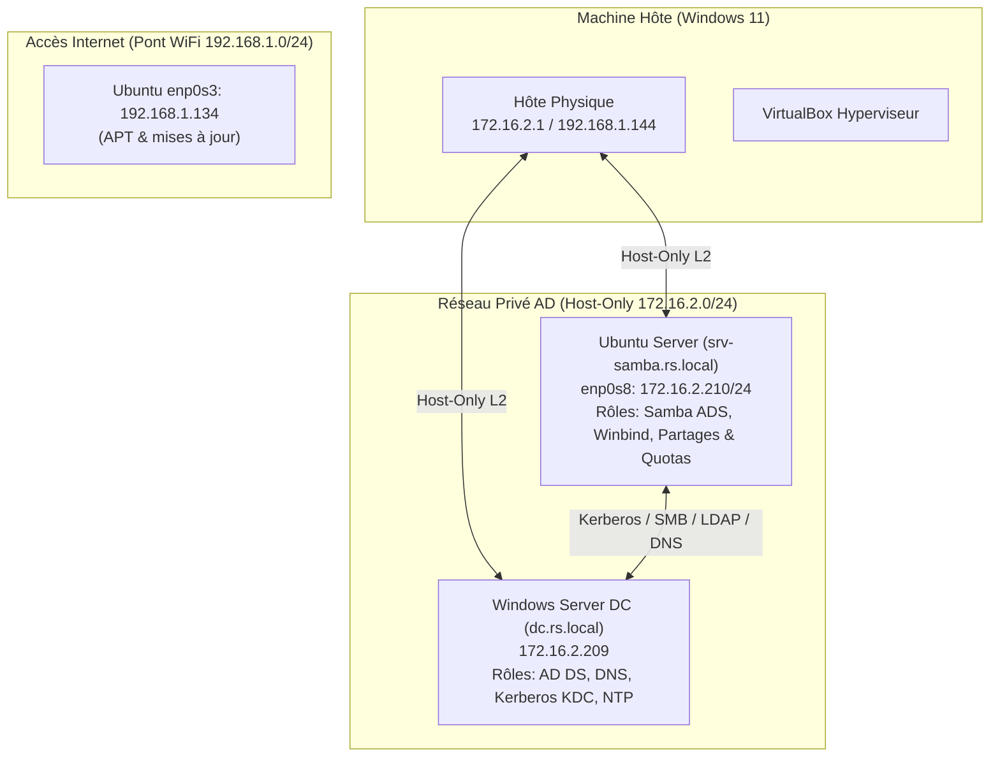

# Documentation Technique Complète — Projet Laboratoire Samba + Active Directory

**Auteur :** Ahmed  
**Environnement :** Laboratoire Système & Réseau (VirtualBox)  
**Date :** 10 Septembre 2026  
**Statut :** Validé à 100% (16/16 tests réussis)

---

## 1. Architecture Générale et Adressage Réseau

### 1.1 Topologie



### 1.2 Tableau d'adressage IP

| Machine | Hostname / FQDN | Rôle | Interface Réseau | Adresse IP / Masque | Passerelle / DNS |
|---|---|---|---|---|---|
| **Windows Server** | `dc` / `dc.rs.local` | Domain Controller (DC) | Ethernet 2 (Host-Only) | `172.16.2.209/24` | Passerelle: `172.16.2.1`<br/>DNS: `127.0.0.1` |
| **Ubuntu Server** | `srv-samba` / `srv-samba.rs.local` | Serveur de Fichiers Samba ADS | `enp0s8` (Host-Only)<br/>`enp0s3` (Pont WiFi) | `172.16.2.210/24`<br/>`192.168.1.134/24` | DNS AD: `172.16.2.209`<br/>Passerelle Internet: `192.168.1.1` |
| **Hôte Physique** | `DESKTOP-K31OC2B` | Station de test / Hyperviseur | VirtualBox Host-Only Adapter | `172.16.2.1/24` | - |

---

## 2. Diagnostic Initial et Résolution Réseau (Sprint 1)

### Problème Initial
- La communication IP entre Ubuntu (`172.16.2.210`) et le DC (`172.16.2.209`) échouait avec un statut ARP `FAILED`.
- Même la machine hôte (`172.16.2.1`) recevait des `Request timed out` en pingant `172.16.2.209`.

### Cause Racine
Dans la machine virtuelle Windows (`server19`), l'adresse statique `172.16.2.209` était assignée à la carte réseau `Ethernet` (liée à l'adaptateur Bridged/WiFi de VirtualBox), tandis que la carte `Ethernet 2` (liée à l'adaptateur Host-Only de VirtualBox) n'avait qu'une adresse APIPA `169.254.156.177`.

### Correction Appliquée
Reconnexion à chaud de la carte 1 de la VM `server19` au réseau Host-Only :
```powershell
& "C:\Program Files\Oracle\VirtualBox\VBoxManage.exe" controlvm server19 nic1 hostonly "VirtualBox Host-Only Ethernet Adapter"
```
**Résultat immédiat :** Ping à 100% avec temps de réponse `< 1ms`.

---

## 3. Configuration Ubuntu & Kerberos (Sprint 1)

### 3.1 Hostname et `/etc/hosts`
- **Hostname :** `srv-samba`
- **FQDN :** `srv-samba.rs.local`
- **`/etc/hosts` :**
```text
127.0.0.1 localhost
172.16.2.210 srv-samba.rs.local srv-samba
172.16.2.209 dc.rs.local dc rs.local
```

### 3.2 Configuration Réseau Durable (`/etc/netplan/00-installer-config.yaml`)
```yaml
network:
  version: 2
  ethernets:
    enp0s3:
      dhcp4: true
      dhcp4-overrides:
        route-metric: 100
    enp0s8:
      addresses:
        - 172.16.2.210/24
      nameservers:
        addresses:
          - 172.16.2.209
        search:
          - rs.local
```

### 3.3 Synchronisation Horloge (Chrony)
Ajout du serveur de temps AD dans `/etc/chrony/chrony.conf` :
```text
server 172.16.2.209 iburst prefer
```
Kerberos tolère un décalage d'horloge maximal de 300 secondes (5 minutes).

### 3.4 Configuration Kerberos (`/etc/krb5.conf`)
Pour résoudre l'erreur `KDC has no support for encryption type`, les types de chiffrement compatibles Active Directory ont été explicitement déclarés :
```ini
[libdefaults]
    default_realm = RS.LOCAL
    dns_lookup_realm = false
    dns_lookup_kdc = true
    rdns = false
    ticket_lifetime = 24h
    renew_lifetime = 7d
    forwardable = true
    default_tkt_enctypes = aes256-cts-hmac-sha1-96 aes128-cts-hmac-sha1-96 rc4-hmac
    default_tgs_enctypes = aes256-cts-hmac-sha1-96 aes128-cts-hmac-sha1-96 rc4-hmac
    permitted_enctypes = aes256-cts-hmac-sha1-96 aes128-cts-hmac-sha1-96 rc4-hmac

[realms]
    RS.LOCAL = {
        kdc = dc.rs.local
        admin_server = dc.rs.local
        default_domain = rs.local
    }

[domain_realm]
    .rs.local = RS.LOCAL
    rs.local = RS.LOCAL
```

### 3.5 Validation Kerberos
```bash
kinit Administrator@RS.LOCAL
klist
```
**Ticket obtenu :** `krbtgt/RS.LOCAL@RS.LOCAL` valide 24 heures.

---

## 4. Jointure au Domaine Active Directory (Sprint 2)

Jointure exécutée avec Samba ADS :
```bash
net ads join -U "Administrator%Azerty123"
```
**Résultat :**
```text
Joined 'SRV-SAMBA' to dns domain 'rs.local'
net ads testjoin -> Join is OK
```

Enregistrement DNS de la machine dans Active Directory :
```bash
samba-tool dns add 172.16.2.209 rs.local srv-samba A 172.16.2.210 -U "Administrator%Azerty123"
```
Résolution DNS validée : `srv-samba.rs.local -> 172.16.2.210`.

---

## 5. Configuration Samba ADS & Winbind (Sprints 3 & 4)

### 5.1 Fichier `/etc/samba/smb.conf`
```ini
[global]
   workgroup = RS
   security = ADS
   realm = RS.LOCAL
   server string = %h Samba AD Member Server

   # Winbind configuration
   winbind use default domain = yes
   winbind offline logon = yes
   winbind enum users = yes
   winbind enum groups = yes
   winbind refresh tickets = yes

   # Shell & Homedir templates
   template shell = /bin/bash
   template homedir = /home/%D/%U

   # ID Mapping RID (déterministe et cohérent)
   idmap config * : backend = tdb
   idmap config * : range = 3000-7999
   idmap config RS : backend = rid
   idmap config RS : range = 10000-999999

   # VFS Objects pour ACLs POSIX & Attributs DOS
   vfs objects = acl_xattr
   map acl inherit = yes
   store dos attributes = yes

   # Sécurité des protocoles SMB
   server min protocol = SMB2_02
   client min protocol = SMB2_02
   map to guest = Bad User

   # Logs
   log file = /var/log/samba/log.%m
   max log size = 1000
```

### 5.2 Configuration NSS (`/etc/nsswitch.conf`)
```text
passwd:         files systemd sss winbind
group:          files systemd sss winbind
```

### 5.3 Création automatique des répertoires personnels
```bash
pam-auth-update --enable mkhomedir
```

### 5.4 Validation Winbind
- `wbinfo -t` : `checking the trust secret for domain RS via RPC calls succeeded`
- `wbinfo -u` : Énumération de `administrator`, `user1`, `user2`, `user3`, `user4`, `khaled`
- `wbinfo -g` : Énumération de `domain admins`, `domain users`, `info`, `drh`, `srv_bkp_users`, `grp-inf`, `grp-drh`
- `id user1` : `uid=11107(user1) gid=10513(domain users) groups=10513(domain users),11116(info),11119(srv_bkp_users)`

---

## 6. Partages Samba, Permissions & ACLs (Sprints 5 & 6)

### 6.1 Matrice des Partages et Droits d'Accès

| Partage Samba | Chemin Linux | Groupes Autorisés | Permissions Linux | ACLs POSIX |
|---|---|---|---|---|
| **[commun]** | `/srv/samba/commun` | `Domain Users`, `Domain Admins` | `drwxrwsr-x (2775)` | `g:domain users:rwx`, `default:g:domain users:rwx` |
| **[informatique]** | `/srv/samba/informatique` | `info`, `grp-inf`, `Domain Admins` | `drwxrws--- (2770)` | `g:info:rwx`, `g:grp-inf:rwx`, `g:domain admins:rwx`, `o::0` |
| **[drh]** | `/srv/samba/drh` | `drh`, `grp-drh`, `Domain Admins` | `drwxrws--- (2770)` | `g:drh:rwx`, `g:grp-drh:rwx`, `g:domain admins:rwx`, `o::0` |
| **[backup]** | `/srv/samba/backup` | `srv_bkp_users`, `Domain Admins` | `drwxrws--- (2770)` | `g:srv_bkp_users:rwx`, `g:domain admins:rwx`, `o::0` |

### 6.2 Définition des partages dans `/etc/samba/smb.conf`
```ini
[commun]
   comment = Partage Commun Entreprise
   path = /srv/samba/commun
   read only = no
   browseable = yes
   guest ok = no
   valid users = @"domain users", @"domain admins"
   create mask = 0664
   directory mask = 0775

[informatique]
   comment = Partage Service Informatique
   path = /srv/samba/informatique
   read only = no
   browseable = yes
   guest ok = no
   valid users = @info, @grp-inf, @"domain admins"
   write list = @info, @grp-inf, @"domain admins"
   create mask = 0660
   directory mask = 0770

[drh]
   comment = Partage Direction Ressources Humaines
   path = /srv/samba/drh
   read only = no
   browseable = yes
   guest ok = no
   valid users = @drh, @grp-drh, @"domain admins"
   write list = @drh, @grp-drh, @"domain admins"
   create mask = 0660
   directory mask = 0770

[backup]
   comment = Partage Sauvegardes
   path = /srv/samba/backup
   read only = no
   browseable = yes
   guest ok = no
   valid users = @srv_bkp_users, @"domain admins"
   write list = @srv_bkp_users, @"domain admins"
   create mask = 0660
   directory mask = 0770
```

---

## 7. Configuration des Quotas Disques (Sprint 7)

### 7.1 Activation sur le système de fichiers Ext4
Options ajoutées dans `/etc/fstab` sur `/dev/sda2` :
```text
/dev/sda2 / ext4 defaults,usrquota,grpquota 0 1
```
Application et initialisation :
```bash
mount -o remount /
quotacheck -cumvg /
quotaon -vug /
```

### 7.2 Quotas assignés
- **Utilisateur AD `user1` (UID 11107) :**
  - Limite souple (soft) : 50 Mo (`51200 KB`)
  - Limite stricte (hard) : 60 Mo (`61440 KB`)
  ```bash
  setquota -u 11107 51200 61440 0 0 /
  ```
- **Groupe AD `info` (GID 11116) :**
  - Limite souple : 200 Mo (`204800 KB`)
  - Limite stricte : 250 Mo (`256000 KB`)
  ```bash
  setquota -g 11116 204800 256000 0 0 /
  ```

### 7.3 Vérification
```text
Disk quotas for user user1 (uid 11107):
     Filesystem  blocks   quota   limit   grace   files   quota   limit   grace
      /dev/sda2       8   51200   61440               1       0       0
```
*Remarque : Samba remonte dynamiquement la taille du quota comme espace disque disponible lors de la connexion du client.*

---

## 8. Sécurité et Pare-feu UFW (Sprint 8)

### 8.1 Règles UFW Appliquées
```bash
ufw default deny incoming
ufw default allow outgoing
ufw allow 22/tcp comment 'SSH Administration'
ufw allow 445/tcp comment 'Samba Active Directory SMB'
ufw allow 139/tcp comment 'Samba NetBIOS Session'
ufw allow 137/udp comment 'Samba NetBIOS Name'
ufw allow 138/udp comment 'Samba NetBIOS Datagram'
ufw enable
```

---

## 9. Tests d'Intégration Windows (Sprint 9)

### 9.1 Montage et Écriture depuis Windows
```cmd
net use \\172.16.2.210\commun /user:RS\Administrator Azerty123
net use \\172.16.2.210\informatique /user:RS\user1 Password123!
```
- Fichier créé depuis Windows : `\\172.16.2.210\informatique\rapport_user1.txt`
- Inspection des ACLs sur Ubuntu :
  - Propriétaire : `user1`
  - Groupe : `domain users`
  - Droits groupe `info:rwx`
  - Autres : `---`

---

## 10. Batterie de Validation Finale (Sprint 10)

Un script de test automatisé en 16 points a été exécuté sur le serveur Ubuntu :

| N° | Test | Commande Exécutée | Résultat |
|---|---|---|---|
| **1** | Connectivité IP DC | `ping -c 2 172.16.2.209` | ✅ **PASS** |
| **2** | Résolution DNS AD | `nslookup dc.rs.local` & `srv-samba.rs.local` | ✅ **PASS** |
| **3** | Ticket Kerberos TGT | `echo Azerty123 \| kinit Administrator@RS.LOCAL` | ✅ **PASS** |
| **4** | Jointure Samba ADS | `net ads testjoin` | ✅ **PASS** (Join is OK) |
| **5** | Secret de Confiance Winbind | `wbinfo -t` | ✅ **PASS** (succeeded) |
| **6** | Énumération Utilisateurs AD | `wbinfo -u` | ✅ **PASS** (users listés) |
| **7** | Énumération Groupes AD | `wbinfo -g` | ✅ **PASS** (groups listés) |
| **8** | Résolution NSS Linux | `getent passwd user1` | ✅ **PASS** (UID 11107) |
| **9** | Services Samba Actifs | `systemctl is-active smbd nmbd winbind` | ✅ **PASS** (active) |
| **10** | Syntaxe smb.conf | `testparm -s` | ✅ **PASS** (Loaded OK) |
| **11** | Énumération Partages SMB | `smbclient -L localhost` | ✅ **PASS** (4 partages) |
| **12** | Vérification ACLs POSIX | `getfacl /srv/samba/informatique` | ✅ **PASS** (group:info:rwx) |
| **13** | Quotas Disques Ext4 | `quota -u 11107 -v` | ✅ **PASS** (51200 KB) |
| **14** | Pare-feu UFW Actif | `ufw status` | ✅ **PASS** (Status: active) |
| **15** | Accès Autorisé (Positif) | `smbclient //localhost/informatique -U user1` | ✅ **PASS** (Accès accordé) |
| **16** | Accès Non Autorisé (Négatif) | `smbclient //localhost/informatique -U user4` | ✅ **PASS** (`NT_STATUS_ACCESS_DENIED`) |

---

## 11. Synthèse des Commandes d'Administration Utiles

### Vérification rapide
```bash
# Vérifier l'état de la jointure AD
net ads testjoin
net ads info

# Vérifier Winbind et les comptes AD
wbinfo -t
wbinfo -u
wbinfo -g
getent passwd <utilisateur_ad>

# Vérifier les tickets Kerberos
klist

# Vérifier les partages et quotas
smbclient -L localhost -U "Administrator%Azerty123"
repquota -ug /
```
